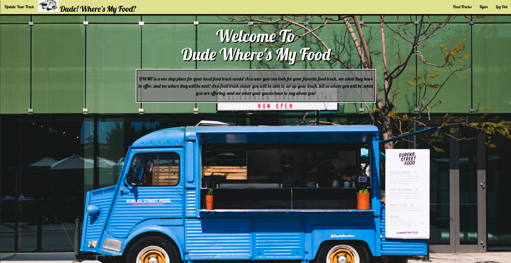
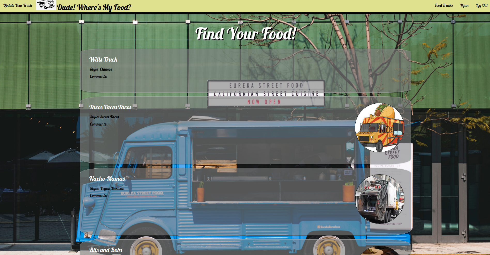
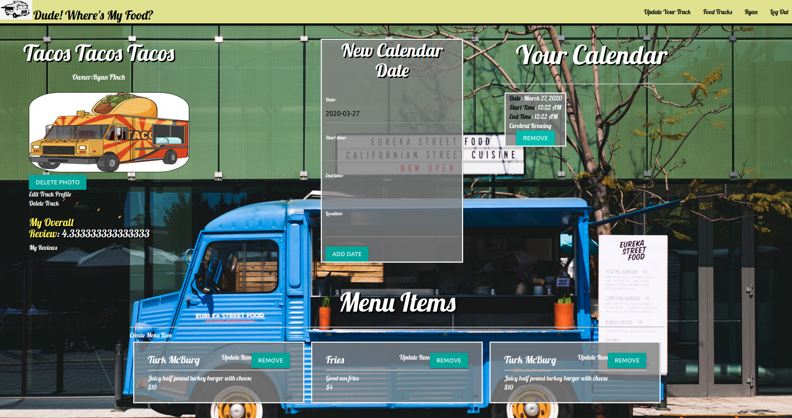
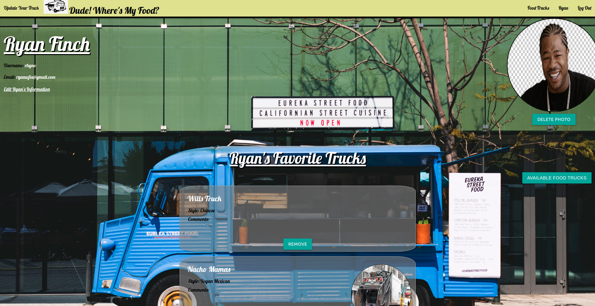
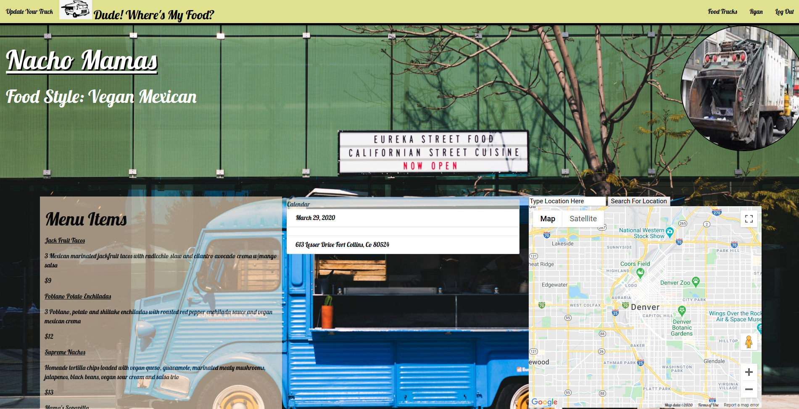

# Dude Wheres My Food
Dude! Where's My Food?

DWMF is an app built to allow users and food truck owners to come together in one place. For users its about being able to search for food trucks and see where they will be and what they are serving, with the ability to favorite their prefered trucks. For food truck owners its about being able to register their truck , set where and when they will be, and what they are serving! All bundled in one place for everyone.

This project was made using:
-Python
-Django
-PostgreSQL
-Javascript
-Materialize
-Basic CSS
-Basic HTML
-Google Maps API

Trello Board Link
https://trello.com/b/GhvVigkN/food-truck-tracker
(Trello contains Wire-Frames and ERD)

Heroku Link
https://dwmf.herokuapp.com/

Pitch-Deck Link
https://docs.google.com/presentation/d/10DB-fqKQSFhlRxq1TSZorTY3t-Ms-8croYkJEURvr38/edit?usp=sharing

Screenshots

Home Page

Index Page

Truck Owner Detail Page

Profile Page

Truck User Detail
